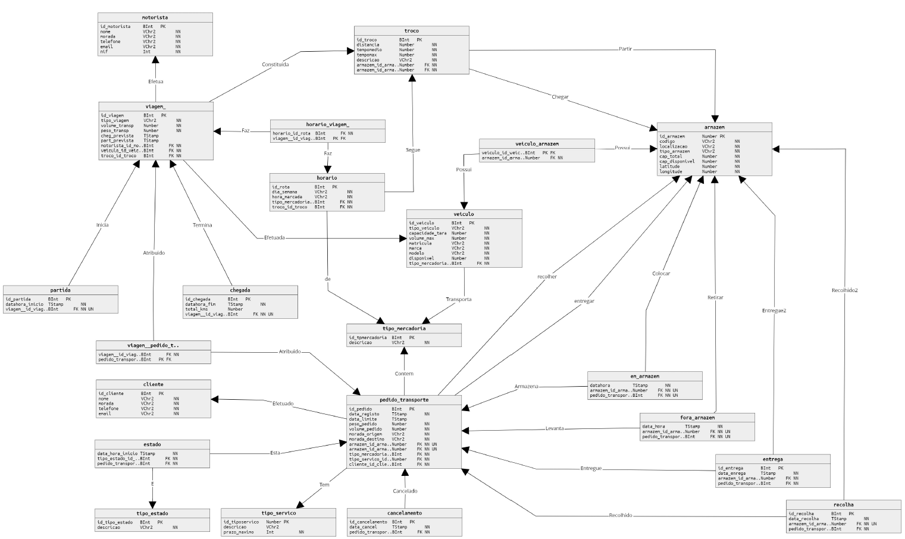

# 📦 Arquitetura-BD: Sistema de Gestão de Transportes

Este projeto visa a implementação de um sistema de base de dados relacional para uma plataforma de **gestão logística de transportes**. A implementação cobre desde o modelo Entidade-Relacionamento (ER) até o modelo físico da base de dados, incluindo algumas funcionalidades como `views`, `procedimentos`, `funções` e `triggers`, conforme indicado num projeto académico.

---

## 🔗 Modelo Físico

---

## 📂 Estrutura do Projeto

O projeto está organizado em diferentes **scripts** para facilitar a sua implementação e manutenção:

- **🆔 Script_Sequencias**: Responsável pela criação de sequências automáticas de IDs para as tabelas.
- **🛠️ Script_Procedimentos**: Contém os procedimentos em PL/SQL utilizados no sistema.
- **🔎 Script_Funcoes**: Inclui funções que fornecem diversas funcionalidades específicas.
- **⚙️ Script_Triggers**: Define `triggers` para manter a integridade dos dados. **Nota**: ainda faltam alguns `triggers` para garantir a total consistência da base de dados.
- **👁️ Script_Views**: Inclui `views` para facilitar a consulta de dados, melhorando a visualização das informações.
- **🏗️ Script_Criacao**: Script principal para a criação do esquema da base de dados e das tabelas.

### 📜 Detalhes
Cada script contém comentários explicativos sobre a sua função. No entanto, alguns scripts ainda estão incompletos ou com comentários parciais.

---

## ⚠️ Limitações e Trabalho Futuro

Embora várias funcionalidades tenham sido implementadas, o projeto ainda não está totalmente funcional. Abaixo estão algumas tarefas pendentes que ainda precisam ser resolvidas para garantir a total operação do sistema.

### 🚧 A Fazer:
- **Implementar `triggers`** adicionais para garantir a **consistência e integridade** dos dados.
- **Desenvolver mais procedimentos e funções** para automatizar processos como o cálculo da ocupação dos armazéns e das rotas de transporte.
- **Melhorar a documentação** dos scripts, adicionando comentários mais detalhados para descrever cada componente.

